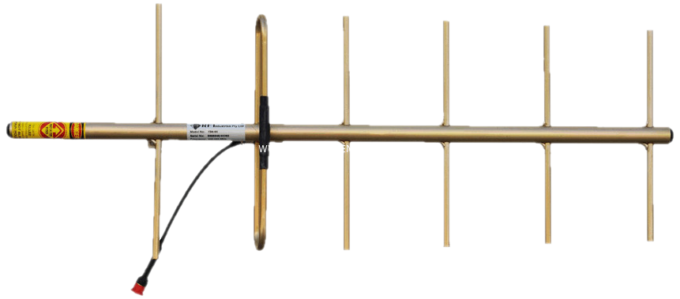
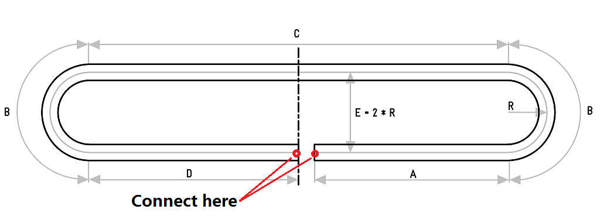

# Yagi Uda Antenna Calculator with Folded Dipole
## constant spacing of 0.2 λ .:. max. length is 5 λ



### Yagi Uda Antenna
**Note :** It is quite possible, that other calculators deliver slightly different results. Some completely hide their algorithms. We use an interpolation approach. Our results are optimised for gain, but others may be optimised for bandwidth, ... However, if the parasitics differ much from 0.4 ±0.05 * λ or the gain is larger than 16 dBd you should get distrustful.



### Folded Dipole
The impedance of this antenna is around 300 Ω, so you may want to use a transformer or a λ/4 long piece of 120 Ω coaxial cable to match this impedance to 50 Ω. Geometriy is not that critical. If you want to put this thing outdoors, do not use brass, as it gets brittle.

## Example
### Settings parameter
set parameter in **settings.js** file.
```js
module.exports = {
    freq:2450,                           // in [MHz]
    elements:20,                         // 3..22 elements
    diameter_of_parasitic_elements:4.9,  // in [mm]
    diameter_of_boom:20,                 // in [mm];
}
```

### Run yagi.js
```bash
$ nodejs yagi.js

**** YAGI UDA ANTENNA ***************************************
 Design by www.changpuak.ch
 https://www.changpuak.ch/electronics/yagi_uda_antenna.php
 Javascript Version 10.11.2020, based on Rothammel / DL6WU
 moded by Hamza BENDALI BRAHAM
*************************************************************

-------------------------------------------------------------
 Frequency                : 2450  MHz
 Wavelength               : 122.449  mm
 d/lambda                 : 0.008  ( min.: 0.001 , max.: 0.04 )
 D/lambda                 : 0.008  ( min.: 0.002 , max.: 0.04 )
 Boomlength               : 465  mm
 Elements                 : 20
 Gain                     : 13.8  dB (approx.)
-------------------------------------------------------------
 Reflector Length      -1 : 59  mm
 Reflector Position       : 0  mm
-------------------------------------------------------------
 Dipole Length, Driven  0 : 59  mm
 Dipole Position          : 24  mm
-------------------------------------------------------------
 Director Length        2 : 55  mm
 Director Position        : 49  mm
-------------------------------------------------------------
 Director Length        3 : 55  mm
 Director Position        : 73  mm
-------------------------------------------------------------
 Director Length        4 : 55  mm
 Director Position        : 98  mm
-------------------------------------------------------------
 Director Length        5 : 55  mm
 Director Position        : 122  mm
-------------------------------------------------------------
 Director Length        6 : 55  mm
 Director Position        : 147  mm
-------------------------------------------------------------
 Director Length        7 : 55  mm
 Director Position        : 171  mm
-------------------------------------------------------------
 Director Length        8 : 55  mm
 Director Position        : 196  mm
-------------------------------------------------------------
 Director Length        9 : 55  mm
 Director Position        : 220  mm
-------------------------------------------------------------
 Director Length       10 : 55  mm
 Director Position        : 245  mm
-------------------------------------------------------------
 Director Length       11 : 55  mm
 Director Position        : 269  mm
-------------------------------------------------------------
 Director Length       12 : 55  mm
 Director Position        : 294  mm
-------------------------------------------------------------
 Director Length       13 : 55  mm
 Director Position        : 318  mm
-------------------------------------------------------------
 Director Length       14 : 55  mm
 Director Position        : 343  mm
-------------------------------------------------------------
 Director Length       15 : 55  mm
 Director Position        : 367  mm
-------------------------------------------------------------
 Director Length       16 : 55  mm
 Director Position        : 392  mm
-------------------------------------------------------------
 Director Length       17 : 55  mm
 Director Position        : 416  mm
-------------------------------------------------------------
 Director Length       18 : 55  mm
 Director Position        : 441  mm
-------------------------------------------------------------
 Director Length       19 : 55  mm
 Director Position        : 465  mm
-------------------------------------------------------------
 Calculations based on NBS TECHNICAL NOTE 688
 Length might be slightly too long.
 Manufacturing Tolerances : < 0  mm
-------------------------------------------------------------
 Folded Dipole            : res/dipole_folded.png
 Lenght A                 : 21.43  mm
 Lenght B                 : 11.28  mm
 Lenght C                 : 45.11  mm
 Lenght D                 : 22.55  mm
 Lenght Gap               : 1.13  mm
 Radius R                 : 3.59  mm
 Rod Diameter             : 0.41  mm
 Total Length             : 112.77  mm
-------------------------------------------------------------
```


## Ref
- [Yagi Uda Antenna](https://www.changpuak.ch/electronics/yagi_uda_antenna.php)  (changpuak.ch)  
- [Folded dipole](https://www.changpuak.ch/electronics/Dipole_folded.php) (changpuak.ch)  
- [Folded dipole](https://www.nonstopsystems.com/radio/frank_radio_antenna_folded_dipole.htm) (frank @ nonstopsystems.com)  