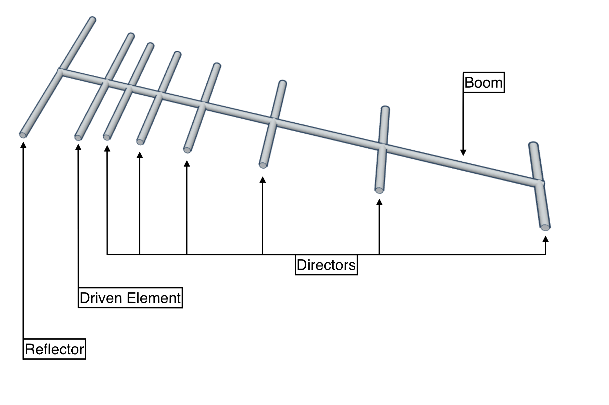

# Yagi Uda Antenna Calculator with Folded Dipole


### Yagi Uda Antenna
**Note :** It is quite possible, that other calculators deliver slightly different results. Some completely hide their algorithms. We use an interpolation approach. Our results are optimised for gain, but others may be optimised for bandwidth, ... However, if the parasitics differ much from 0.4 ±0.05 * λ or the gain is larger than 16 dBd you should get distrustful.


### Folded Dipole
The impedance of this antenna is around 300 Ω, so you may want to use a transformer or a λ/4 long piece of 120 Ω coaxial cable to match this impedance to 50 Ω. Geometriy is not that critical. If you want to put this thing outdoors, do not use brass, as it gets brittle.

## Example
### Settings parameter


set parameter in **settings.js** file.
```js
module.exports = {
    freq:2450,                            // in [MHz]
    elements:15,                          // 3..22 elements
    diameter_of_parasitic_elements:4,     // in [mm]
    diameter_of_boom:20,                  // in [mm]
    boom_isolated:true,                   // true, false
}
```

### RUN
```bash
$ nodejs yagi.js # Based on Rothammel / DL6WU
```
or
```bash
$ nodejs yagi_constant_spacing.js # constant spacing of 0.2 λ .:. max. length is 5 λ
```

```bash
**** YAGI UDA ANTENNA ***************************************
 Design by www.changpuak.ch
 https://www.changpuak.ch/electronics/yagi_uda_antenna.php
 Javascript Version 12.01.2014, based on Rothammel / DL6WU
 moded by Hamza BENDALI BRAHAM
*************************************************************

-------------------------------------------------------------
 Frequency          : 2400  MHz
 Wavelength         : 125  mm
 d/lambda           : 0.032  ( min.: 0.002 , max.: 0.01 )
 D/lambda           : 0.050  ( min.: 0.01 , max.: 0.05 )
 Boom Diameter      : 6.25  mm
 Boom Length        : 505  mm
 Elements           : 15
 Rod Diameter       : 4  mm
 Gain               : 13.88 dBd (approx.)
-------------------------------------------------------------
 Reflector Position :  0 mm
 Reflector Length   : 60 mm
-------------------------------------------------------------
 Dipole Position    : 30 mm
 Lenght A           : 21.87  mm
 Lenght B           : 11.51  mm
 Lenght C           : 46.05  mm
 Lenght D           : 23.02  mm
 Lenght E           : 7.33  mm
 Lenght Gap         : 1.15  mm
 Radius R           : 3.66  mm
 Rod Diameter       : 0.42  mm
 Total Length       : 115.12  mm
-------------------------------------------------------------
 Director #1        : Position:  39 mm (+9),  Length: 57 mm
 Director #2        : Position:  62 mm (+23),  Length: 56 mm
 Director #3        : Position:  89 mm (+27),  Length: 56 mm
 Director #4        : Position: 120 mm (+31),  Length: 55 mm
 Director #5        : Position: 155 mm (+35),  Length: 55 mm
 Director #6        : Position: 193 mm (+38),  Length: 54 mm
 Director #7        : Position: 232 mm (+39),  Length: 54 mm
 Director #8        : Position: 273 mm (+41),  Length: 54 mm
 Director #9        : Position: 316 mm (+43),  Length: 54 mm
 Director #10       : Position: 361 mm (+45),  Length: 53 mm
 Director #11       : Position: 408 mm (+47),  Length: 53 mm
 Director #12       : Position: 456 mm (+48),  Length: 53 mm
 Director #13       : Position: 505 mm (+49),  Length: 53 mm
-------------------------------------------------------------
 Directors / Parasitics are isolated.
 Please choose an isolater thicker than : 3 mm
-------------------------------------------------------------
```


### References
- [Yagi Uda Antenna](https://www.changpuak.ch/electronics/yagi_uda_antenna.php)  (changpuak.ch)  
- [Folded dipole](https://www.changpuak.ch/electronics/Dipole_folded.php) (changpuak.ch)  
- [Folded dipole](https://www.nonstopsystems.com/radio/frank_radio_antenna_folded_dipole.htm) (frank @ nonstopsystems.com)  
- [Wikipedia.org](https://en.wikipedia.org/wiki/Yagi%E2%80%93Uda_antenna)  